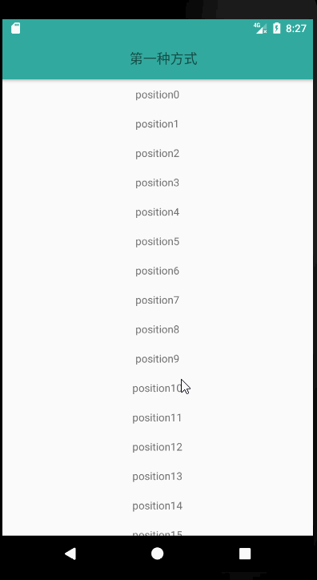

## CoordinatorLayout

**coordinatorLayout** (协调布局)其实就是将其下的所有子View都抽象成: **互相依赖(depends)的关系.** 因此某个view可以基于另一个view来定位,

这样抽象的好处更强大的地方在于:

每一个view的所有属性, 坐标, 样式, 状态等一切都可以依赖于另一个view, 因此使得parentView和所有childView之间都可以互相联动起来.
想象一下, 不仅仅是定位, 所有可以设置在View上面的属性都可以依赖于另一个view的变化而变化, 某一个View可以跟随另一个View一起滚动, 某一个View可以跟随另一个View的状态改变而改变, 性能非常的强大;

### CoordinatorLayout的Behavior

Behavior是Android新出的Design库里新增的布局概念。Behavior只有是CoordinatorLayout的**直接子View**才有意义。可以为任何View添加一个Behavior。

Behavior是一系列回调。让你有机会以非侵入的为View添加动态的依赖布局，和处理父布局(CoordinatorLayout)滑动手势的机会。

不过官方只有少数几个Behavior的例子。并且实现类也很少;默认也只有几种实现,有的复杂的需求就需要自己去实现自定义的Behavior

先说一下这个属性 `app:layout_scrollFlags`

1） scroll:值设为scroll的View会跟随滚动事件一起发生移动。

2） enterAlways:值设为enterAlways的View,当ScrollView往下滚动时，该View会直接往下滚动。而不用考虑ScrollView是否在滚动。

3） exitUntilCollapsed：值设为exitUntilCollapsed的View，当这个View要往上逐渐“消逝”时，会一直往上滑动，直到剩下的的高度达到它的最小高度后，再响应ScrollView的内部滑动事件。

4） enterAlwaysCollapsed：是enterAlways的附加选项，一般跟enterAlways一起使用，它是指，View在往下“出现”的时候，首先是enterAlways效果，当View的高度达到最小高度时，View就暂时不去往下滚动，直到ScrollView滑动到顶部不再滑动时，View再继续往下滑动，直到滑到View的顶部结束。

### 例子
下面就用协调布局写几个常用的例子;

效果1:toolbar随子view的滚动显示和隐藏
如下图:

效果2:结合CollapsingToolbarLayout缩放图片和toolBar

如下图:

效果3:类似知乎首页滑动显示和影藏的效果;
如下图:

效果4:viewpager+fragment,滑动渐变改变indicator;
如下图:

